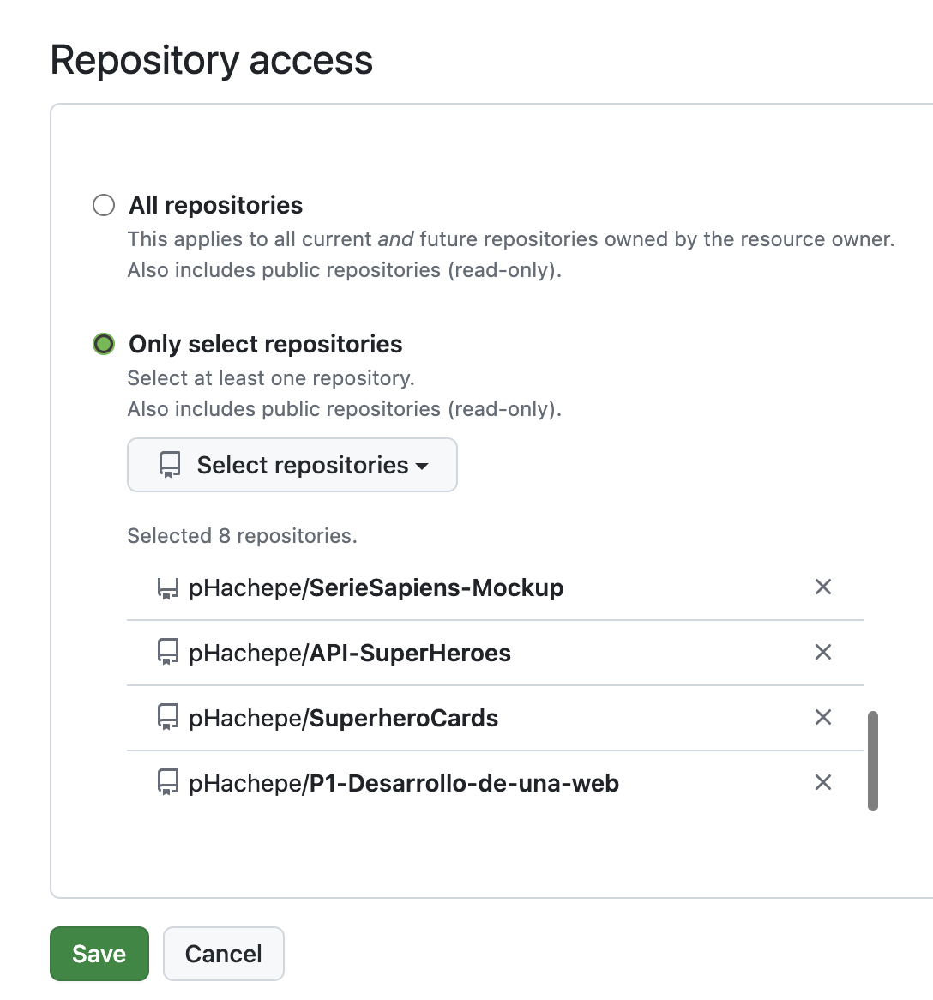
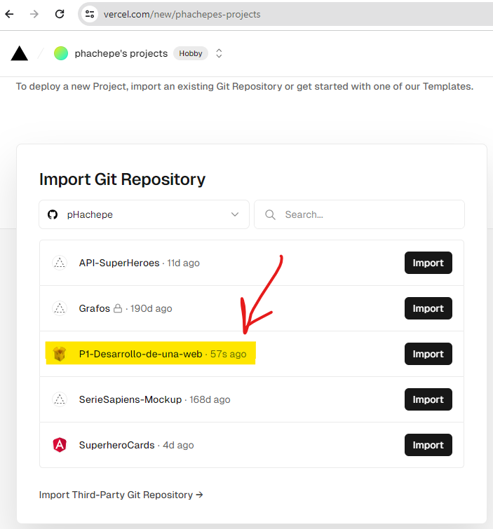
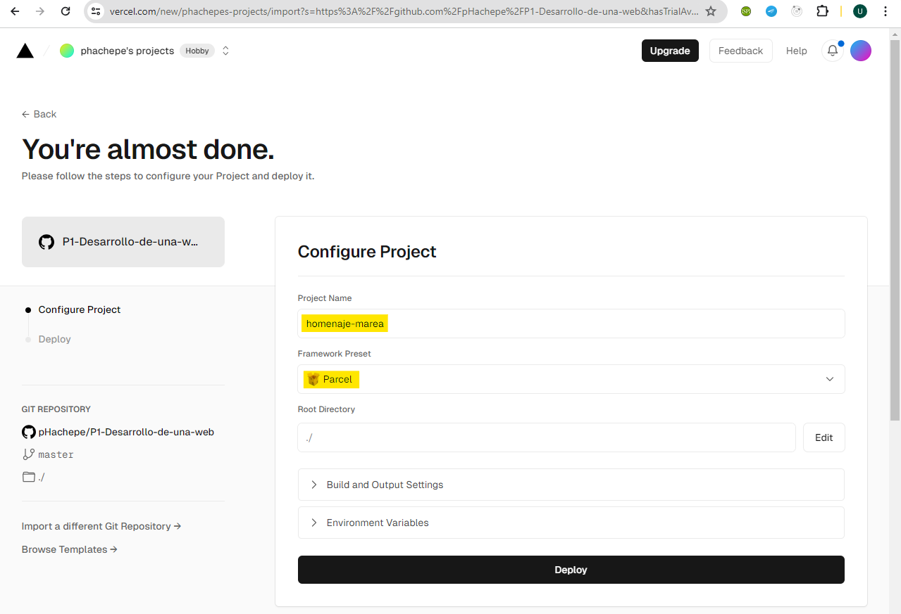
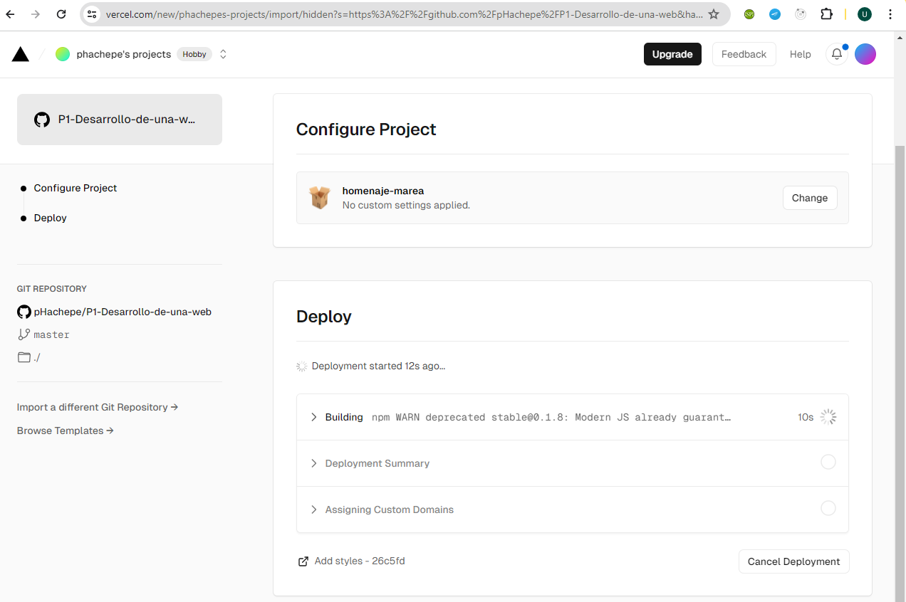
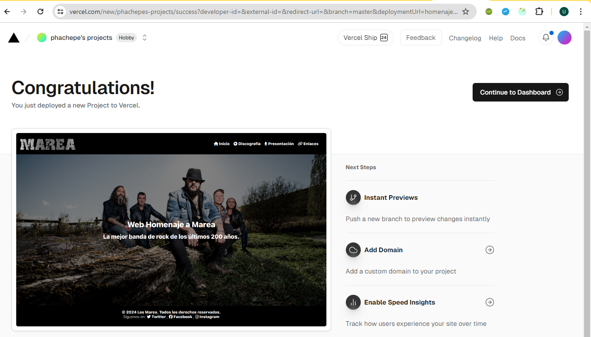

# Documentación del Proyecto: Homenaje a Marea

Este documento explica detalladamente cada paso realizado en el desarrollo del proyecto web de la PEC1 de Herramientas HTML y CSS I, utilizando Parcel como empaquetador. También se describen las decisiones técnicas y las configuraciones aplicadas.

## Enlaces Importantes

- **Repositorio del código:** [GitHub - P1-Desarrollo-de-una-web](https://github.com/pHachepe/P1-Desarrollo-de-una-web)
- **URL pública de la web:** [Homenaje a Marea](https://homenaje-marea.vercel.app)

# 1. Creación del Boilerplate Basado en Parcel

## Configuración Inicial del Proyecto

Para iniciar, establecemos la estructura de directorios y archivos que organizan claramente los componentes, estilos y scripts del proyecto, me he basado en los ejemplos del módulo 2 y en la documentación oficial de Parcel.
La división de los estilos podría mejorarse, pero por simplicidad he optado por una estructura básica.
He creado un json con los datos de los álbumes, para poder mostrarlos en la página de categoría(discografía) y en la página de detalle de forma dinámica.
```
PEC1
├── .gitignore
├── .posthtmlrc
├── package-lock.json
├── package.json
├── README.md
└── src
    ├── assets
    │   └── images
    │       ├── albums
    │       ├── logo.png
    │       └── portada.jpeg
    ├── components
    │   ├── footer.html
    │   └── header.html
    ├── data
    │   └── albumsData.js
    ├── pages
    │   ├── category.html
    │   ├── detail.html
    │   ├── index.html
    │   ├── links.html
    │   └── presentation.html
    ├── scripts
    │   ├── category.js
    │   ├── detail.js
    │   └── header.js
    └── styles
        ├── _base.scss
        ├── _header.scss
        ├── _responsive.scss
        ├── _variables.scss
        └── main.scss
```

Inicializamos Node.js en nuestro proyecto para preparar el entorno de desarrollo:

```bash
npm init -y
```

Instalamos Parcel como dependencia de desarrollo:

```bash
npm install parcel --save-dev
```

Eliminamos main de package.json porque interfiere con parcel:
```json
  "main": "index.js",
```

## Configuración de Scripts en `package.json`

Configuramos los siguientes scripts en Parcel para simplificar las tareas de desarrollo y producción:

- **start**: `"npm-run-all clean parcel:dev"`
    - Ejecuta `clean` seguido de `parcel:dev` para iniciar el servidor de desarrollo con una configuración limpia.
- **build**: `"npm-run-all clean parcel:build"`
    - Compila los archivos para producción después de limpiar, optimizando para el mejor rendimiento.
- **clean**: `"rimraf dist .parcel-cache"`
    - Limpia el proyecto eliminando los directorios `dist` y `.parcel-cache`, asegurando compilaciones limpias.
- **parcel:dev**: `"parcel serve src/pages/*.html --open"`
    - Inicia Parcel en modo desarrollo, sirviendo todas las páginas HTML desde `src/pages`, y abre automáticamente la página en el navegador.
- **parcel:build**: `"parcel build src/pages/*.html --dist-dir dist --public-url ./"`
    - Compila y optimiza los archivos para producción, configurando el directorio de salida en `dist` y ajustando la URL pública para los recursos.

## Soporte para Navegadores Antiguos

Utilizamos el campo `browserslist` en el `package.json` para definir qué versiones de navegadores queremos soportar. Esto es muy importante para asegurar que nuestro sitio funcione correctamente en navegadores tanto modernos como antiguos.

```
"browserslist": "> 0.5%, last 2 versions, not dead"
```

Esta configuración inicial establece las bases para la creación de un boilerplate basado en Parcel, que nos permitirá desarrollar un proyecto bien organizado, optimizado y con soporte para navegadores antiguos.

# 2. Gestión de Dependencias: Pre- o Postprocesadores y Dependencias Adicionales

## Dependencias Internas Utilizadas

- **@parcel/transformer-sass**
   - **Descripción**: Permite a Parcel compilar archivos SASS o SCSS a CSS, ofreciendo funcionalidades avanzadas como variables, mixins y anidación.
   - **Instalación**: Se puede instalar a través de npm ejecutando `npm install @parcel/transformer-sass --save-dev`.
   - **Configuración**: Parcel gestiona automáticamente la compilación de SASS cuando el paquete está instalado. No se necesita configuración adicional en el `package.json` para su funcionamiento básico.
   - **Impacto en Producción**: Optimiza y minimiza el CSS generado, mejorando la carga de la página y el rendimiento.

- **posthtml-include**
   - **Descripción**: Permite incluir fragmentos de HTML dentro de otros archivos HTML, ideal para reutilizar componentes como encabezados y pies de página.
   - **Instalación**: Se puede instalar a través de npm ejecutando `npm install posthtml-include --save-dev`.
   - **Configuración**: Requiere un archivo `.posthtmlrc.json` en la raíz del proyecto. Aquí se define el directorio raíz para los includes, permitiendo que el proceso de compilación sepa dónde buscar los archivos a incluir.
     ```json
     {
       "plugins": {
         "posthtml-include": {
           "root": "./src"
         }
       }
     }
     ```
   - **Impacto en Producción**: Compila todos los fragmentos en un único archivo HTML por página, disminuyendo el número de solicitudes HTTP necesarias y mejorando la velocidad de carga.

## Dependencia Externa: FontAwesome
- **rimraf**
  - **Descripción**: Permite eliminar directorios y archivos de forma cruzada, compatible con Windows, Linux y macOS.
  - **Instalación**: Se puede instalar a través de npm ejecutando `npm install rimraf --save-dev`.
  - **Configuración**: Se utiliza en el script `clean` para eliminar los directorios `dist` y `.parcel-cache` antes de cada compilación.
  - **Impacto en Producción**: Asegura que las compilaciones se realicen en un entorno limpio, evitando conflictos y errores.
- **npm-run-all**
  - **Descripción**: Permite ejecutar múltiples scripts de npm en paralelo o en serie, simplificando la ejecución de tareas complejas.
  - **Instalación**: Se puede instalar a través de npm ejecutando `npm install npm-run-all --save-dev`.
  - **Configuración**: Se utiliza en los scripts `start` y `build` para ejecutar tareas en secuencia, como limpiar el proyecto y compilar los archivos.
  - **Impacto en Producción**: Mejora la eficiencia y la organización de los scripts, permitiendo una gestión más sencilla de las tareas de desarrollo y producción.
- **FontAwesome**
  - **Descripción**: Proporciona una extensa biblioteca de iconos vectoriales que se pueden usar fácilmente en proyectos web.
  - **Instalación**: Se puede instalar a través de npm ejecutando `npm install @fortawesome/fontawesome-free --save`.
  - **Configuración**: Después de instalar FontAwesome, los iconos pueden ser agregados a cualquier archivo HTML o CSS simplemente referenciando las clases proporcionadas por FontAwesome. Por ejemplo, para agregar un icono del logo de GitHub:
    ```html
    <i class="fab fa-github"></i>
    ```
  - **Impacto en Producción**: Los iconos se cargan de manera eficiente usando fuentes o SVG, lo que mejora la estética del sitio sin comprometer la velocidad de carga.

# 3. Creación del Repositorio Git

## Inicialización de Git y Configuración de `.gitignore`

Para gestionar el versionado y colaboración en nuestro proyecto (aunque en este caso sea individual), inicializamos un repositorio Git en la raíz del mismo.

```bash
git init
```

Después de inicializar el repositorio, creamos y configuramos un archivo `.gitignore` para evitar que archivos no deseados o sensibles se suban al repositorio.
El archivo `.gitignore` incluye:

```
node_modules/
dist/
.parcel-cache/
.DS_Store
```

- **node_modules/**: Contiene las dependencias de npm, se puede restaurar con `npm install` y no es necesario en el repositorio.
- **dist/**: Directorio de construcción para la versión de producción, específico para cada build y no incluido en el repositorio.
- **.parcel-cache/**: Caché de Parcel que acelera las reconstrucciones, no debe versionarse.
- **.DS_Store**: Archivos ocultos de macOS que no son relevantes para el proyecto.

## Creación del Repositorio Remoto en GitHub

Para facilitar la colaboración y el seguimiento de cambios, creamos un repositorio remoto en GitHub y lo vinculamos con el repositorio local.

```bash
git remote add origin https://github.com/pHachepe/P1-Desarrollo-de-una-web.git
```

## Comandos Básicos de Git para la Gestión del Proyecto

Los comandos más básicos de Git utilizados para la gestión del proyecto son:

- **git add .** - Prepara los cambios actuales para el siguiente commit.
- **git commit -m "Descripción de los cambios"** - Guarda una instantánea de los cambios con un mensaje autoexplicativo de los cambios realizados.
- **git push** - Envía los cambios al repositorio remoto, actualizando el proyecto alojado en GitHub.

# 4. Adecuación a la Temática y Estructura de la Práctica

La adecuación del proyecto a la temática y la estructura es un aspecto básico para garantizar que el sitio web cumpla con los objetivos establecidos y las necesidades del curso.
La temática del proyecto se centra en rendir homenaje al grupo musical "Marea", por lo que el diseño y contenido del sitio están orientados a reflejar la estética y el estilo de la banda. La mayoría de las decisiones de diseño y estructura se basan en la identidad visual reflejada en su web oficial.

## Temática del Sitio

El sitio web está diseñado para capturar la esencia de "Marea", utilizando una paleta de colores oscuros y semitransparencias oscuras que recuerdan al estilo rock y underground. Las imágenes utilizadas están extraídas de la web oficial de la banda y de su discografía, y son clave para establecer el tono visual oscuro del sitio. Se incluyen fotos de la banda, portadas de álbumes y un videoclip de una de sus canciones más conocidas en la página de presentación, mostrado de fondo con una transparencia baja para no interferir con el contenido.

## Estructura del Sitio

La estructura del sitio se organiza de la siguiente manera para asegurar que se encuentre fácilmente la información y que sea una navegación intuitiva:

- **Inicio**: Presenta brevemente a la banda y ofrece un menú claro para acceder a las diferentes secciones.
- **Discografía (Categoría)**: Detalla los álbumes de la banda, cada uno con su propia subpágina donde se puede encontrar más información sobre cada álbum específico, se muestra de forma dinámica con los datos almacenados en un archivo json.
- **Detalles del Álbum**: Proporciona información sobre cada álbum, incluyendo portadas, listados de canciones, fechas de lanzamiento y pequeñas reseñas o anécdotas de la creación del álbum.
- **Biografía (Presentación)**: Narra la historia de la banda, sus inicios, evolución y los hitos más importantes en su carrera, con un video de fondo que muestra la energía y la pasión de la banda en directo.
- **Enlaces**: Ofrece información sobre los derechos de autor, el origen de las imágenes y videos utilizados, y enlaces a las fuentes originales para respetar la propiedad intelectual de la banda y a los creadores del contenido original. Así como las fuentes de información y recursos utilizados para la creación del sitio.

## Adaptación a la Práctica

La implementación del sitio sigue las directrices de los dos primeros módulos de Herramientas HTML y CSS I, asegurando que se utilizan técnicas actuales y efectivas para el desarrollo web:

- **HTML Semántico**: Uso de etiquetas semánticas que definen claramente las partes del sitio (como `<header>`, `<footer>`, `<main>`, y `<aside>`), mejorando tanto la accesibilidad como el SEO.
- **CSS Moderno y Responsive**: Utilización de Flexbox y Grid para layouts responsivos que se adaptan a diferentes tamaños de pantalla, asegurando una experiencia de usuario coherente en dispositivos móviles, tablets y desktops.
- **Parcel como Herramienta de Construcción**: Facilita la automatización de tareas como la minificación de código y la compilación de SASS a CSS, optimizando los tiempos de carga y la eficiencia del desarrollo.
- **Inclusión de Fragmentos HTML**: Utilización de PostHTML para incluir fragmentos de HTML reutilizables en diferentes páginas, como el encabezado y el pie de página, simplificando la gestión y mantenimiento del código.
- **Importación de Estilos y Scripts**: Organización de los estilos y scripts en archivos separados y su importación en el archivo principal, permitiendo una estructura modular y escalable del proyecto. Usando SASS para la creación de estilos y JavaScript para la interactividad de la página. Con las dependencias de transformer-sass y transformar-js de Parcel.
- **Datos Dinámicos con JSON**: Almacenamiento de los datos de los álbumes en un archivo JSON para mostrarlos de forma dinámica en la página de discografía y en las subpáginas de detalle de álbumes, permitiendo una actualización sencilla y escalable de la información.
- **FontAwesome para Iconos**: Integración de FontAwesome para añadir iconos vectoriales a la web, mejorando la estética y la usabilidad del sitio sin sacrificar la velocidad de carga.
- **Gestión de Dependencias con npm**: Utilización de npm para gestionar las dependencias del proyecto, asegurando que las versiones de las librerías y herramientas utilizadas sean coherentes y actualizadas.
- **Git para Control de Versiones**: Utilización de Git para el control de versiones del proyecto, permitiendo un seguimiento detallado de los cambios realizados y facilitando la colaboración en el desarrollo del sitio.
- **GitHub para Repositorio Remoto**: Creación de un repositorio remoto en GitHub para alojar el código del proyecto.
- **Vercel para Despliegue**: Utilización de Vercel para desplegar el sitio web de forma pública y accesible, permitiendo una visualización y compartición sencilla del proyecto.
- **Documentación Detallada**: Creación de un README.md detallado que explica cada paso del desarrollo del proyecto, las decisiones técnicas tomadas y las configuraciones aplicadas, facilitando la comprensión y el seguimiento del proceso.

# 5. Diseño Responsive, Complejidad y Estética

El diseño del sitio está cuidadosamente elaborado para ser completamente responsive, adaptándose a una variedad de dispositivos y tamaños de pantalla, intentando garantizar una experiencia de usuario fluida y estéticamente agradable.

## Diseño Responsive

He implementado múltiples técnicas de diseño responsive utilizando CSS y SCSS, destacando las siguientes características:

### Menú de Hamburguesa en Resoluciones Bajas

En dispositivos con pantallas estrechas (menos de 768px de ancho), el menú de navegación se transforma en un menú de hamburguesa que los usuarios pueden expandir y contraer:

```scss
@media (max-width: 768px) {
  header {
    .menu-toggle {
      display: block; // Se muestra solo en pantallas pequeñas
      margin-left: auto;
    }

    nav ul {
      background-color: $color-black;
      display: none; // Oculto inicialmente en móviles
      flex-direction: column; // Alinear elementos del menú verticalmente
      position: absolute;
      top: 100%; // Coloca el menú justo debajo del header
      left: 0;
      right: 0;
      width: 100%;
      z-index: 500;
    }

    &.open {
      display: flex; // Mostrar cuando el menú esté activo
    }
  }
}
```

Para que esto funcioe también se ha utilizado una pequeña función de JavaScript para añadir la funcionalidad de abrir y cerrar el menú cambiando la clase `open` al menú y las clases de los iconos fontawesome del menú hamburguesa de fa-bars (tres líneas horizontales) a fa-times (una X) y viceversa.

```javascript
  mobileMenu.addEventListener("click", () => {
    menuList.classList.toggle("open");
    mobileMenu.innerHTML = menuList.classList.contains("open")
      ? '<i class="fas fa-times"></i>'
      : '<i class="fas fa-bars"></i>';
  });
```

### Ajuste Dinámico de la Disposición de Contenidos

El contenido se reorganiza dinámicamente basado en la resolución de la pantalla. Por ejemplo, los álbumes recomendados que normalmente aparecen al lado derecho de la pantalla en resoluciones grandes, se mueven hacia abajo en resoluciones menores para mejor la accesibilidad:

```scss
@media (max-width: 1024px) {
  .recommended-albums {
    margin-top: 1rem;
    width: 100%;

    #recommended-list {
      display: flex;
      flex-wrap: nowrap;
      overflow-x: auto;
    }
  }
}
```

## Estética Avanzada y Funcionalidades CSS

### Video de Fondo con Overlay Semitransparente

Implementé un video de fondo en la página de presentación con un overlay semitransparente, lo que proporciona profundidad visual sin comprometer la legibilidad del texto sobre el video:

```scss
  .overlay {
    background: rgba($color-black, 0.6);
    box-shadow: 0 4px 8px rgba(0, 0, 0, 0.5);
    color: $color-white;
    height: 100%;
    margin: auto;
    padding: 1rem;
    position: relative;
    text-align: center;
    width: 100%;
    z-index: 10;

    &-content {
      background: rgba($color-black, 0.2);
      border-radius: 10px;
      display: flex;
      flex-direction: column;
      height: 100%;
      margin: auto;
      overflow: auto;
      padding: 3rem;
      text-align: justify;
      width: 70%;
    }
  }
````

En las páginas de inicio y enlaces se ha utilizado algo similar, con un fondo con una imagen de portada y un overlay semitransparente para mejorar la legibilidad del texto:

```scss
#home {
  background: linear-gradient(rgba(0, 0, 0, 0.5), rgba(0, 0, 0, 0.5)), url("../assets/images/portada.jpeg");
  background-size: cover;
  background-position: center;
}
```

### Uso de Variables y SCSS para la Gestión de Estilos

Creé un archivo de SCSS para definir variables que ayudan a mantener la consistencia en los estilos a través del sitio, facilitando cambios globales y manteniendo los estilos organizados y fácilmente mantenibles:

```scss
$color-black: #000;
$color-blue: #2980b9;;
$color-dark-blue: #2c3e50;
$color-dark-grey: #ddd;
$color-light-grey: #ccc;
$color-white: #fff;
```

### Aspect Ratio y Lazy Loading

Las imágenes utilizan `aspect-ratio` para mantener sus proporciones automáticamente, mejorando la experiencia de usuario al evitar saltos visuales mientras las imágenes se cargan, algo que personalmente me molesta mucho cuando estoy navegando por una web.

```scss
img {
  aspect-ratio: 1;
  display: block;
  height: auto;
  width: 100%;
}
```

Además, les puse el atributo `lazy loading` para optimizar los tiempos de carga y el rendimiento del sitio:

```html

```

Estas técnicas no solo mejoran la estética del sitio, sino que también optimizan la experiencia del usuario en diferentes dispositivos y velocidades de conexión. Hay otras técnicas que se han utilizado para mejorar la estética y la funcionalidad del sitio, como la inclusión de iconos de FontAwesome, pero estas son las más destacadas.

# 6. Semántica y Accesibilidad

El enfoque en la semántica y accesibilidad es básico para garantizar que el sitio web sea usable y accesible para todos los usuarios, incluyendo aquellos con discapacidades. Además también mejora el SEO del sitio permitiendo a los motores de búsqueda entender mejor el contenido de la página. En otra asignatura de este máster, `HTML y CSS`, hemos profundizado mucho en estos aspectos.

## Uso de Etiquetas Semánticas HTML

He utilizado etiquetas HTML semánticas que ayudan a describir el significado del contenido de la página web de manera más precisa que solo con divs o spans.
Estas etiquetas incluyen, entre otras:

- `<header>` para las cabeceras de página.
- `<nav>` para los menús de navegación.
- `<main>` para el contenido principal.
- `<section>` para definir secciones.
- `<article>` para artículos independientes o contenidos relacionados (esta creo que no la he utilizado).
- `<footer>` para los pies de página.

Dichas etiquetas nos ayudan a estructurar el documento HTML de manera lógica y clara, facilitando la navegación por lectores de pantalla y otros asistentes tecnológicos.

## Características de Accesibilidad Implementadas

### Atributos Alt en Imágenes

Cada imagen incluye un atributo `alt` descriptivo que proporciona una descripción clara de la imagen para asistencia tecnológica, crucial para usuarios con discapacidades visuales, además de permitir a los motores de búsqueda indexar y clasificar las imágenes correctamente:

```html

```

### Diseño Responsive

El diseño responsive asegura que el sitio sea accesible en dispositivos móviles y tablets, no solo en ordenadores de sobremesa.
Por ejemplo, el menú de hamburguesa permite a los usuarios de dispositivos móviles navegar por el sitio de forma cómoda y sencilla.

### Lazy Loading de Imágenes

El lazy loading mejora la accesibilidad al reducir el tiempo de carga de la página, lo que es especialmente útil para usuarios con conexiones lentas a internet:

```html

```

## Mejoras de Accesibilidad

Además de estas implementaciones, para asegurar que todos los elementos sean accesibles, podríamos proporcionar roles y etiquetas ARIA donde sea necesario para mejorar la accesibilidad del contenido dinámico y los controles de interfaz, pero considero que queda fuera del alcance de esta práctica.

# 7. Publicación a internet

Aunque en los módulos se explicaba cómo desplegar la web en Netlify, he optado por desplegarla en Vercel, ya que es la plataforma que he utilizado en otros proyectos y me resulta más cómoda y sencilla de utilizar.
Vercel es una plataforma de desarrollo web que permite desplegar aplicaciones web de forma sencilla y rápida, con integración con GitHub, de forma que cada vez que se subimos un push a la rama principal del repositorio en GitHub, se despliega automáticamente la web en Vercel.

## Despliegue en Vercel

> [!IMPORTANT]
> Damos por hecho que el repositorio ya está subido a GitHub y que tenemos una cuenta en Vercel.

### Configuración de Vercel
Para desplegar la web en Vercel, simplemente hay que seguir los siguientes pasos:

1. Acceder a la página de [Vercel](https://vercel.com/) e iniciar sesión con nuestra cuenta.
2. Hacer clic en el desplegable "Add New..." en la esquina superior derecha y seleccionar "Project".
3. Nos pedirá que le demos permisos para acceder a nuestra cuenta de GitHub, le damos los permisos necesarios, bien sobre toda la cuenta o bien solo sobre el repositorio concreto que queremos desplegar en la web.
  
4. Una vez demos permisos, nos aparecerá una lista con todos los repositorios de GitHub sobre los que hayamos dado permisos a Vercel, seleccionamos el que queremos desplegar y hacemos clic en "Import".
  
5. Nos aparecerá una pantalla de configuración del proyecto, donde podremos darle un nombre, seleccionar el framework que estamos utilizando (suele detectarlo automáticamente correctamente), seleccionar la ruta raíz del proyecto, definir las variables de entorno, configurar opciones de construcción, y otras opciones avanzadas. En nuestro caso, simplemente dejamos la configuración por defecto, le damos un nombre y hacemos clic en "Deploy".
  
6. Esperamos a que Vercel compile y despliegue la web, al ser una web tan sencilla, el proceso suele ser muy rápido, en unos segundos ya tendremos la web desplegada y accesible a través de la URL que nos proporciona Vercel.
  
7. Una vez desplegada, Vercel nos proporcionará la URL pública de la web, que podremos compartir y acceder a ella en cualquier momento.
  
8. Se puede visitar la web desplegada en: https://homenaje-marea.vercel.app
9. Cada vez que hagamos un push a la rama principal del repositorio en GitHub, Vercel detectará los cambios y en pocos segundos desplegará automáticamente la web con las últimas actualizaciones.
